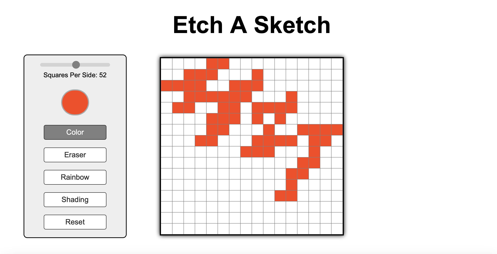

# Etch A Sketch

This was `Etch A Sketch`, the [*4th project*](https://www.theodinproject.com/lessons/foundations-etch-a-sketch) within the Odin Project curriculum. This was an assignment designed to make students utilise the Internet during errors and issues, applying fundamental skills learnt to an application project.

In Etch A Sketch, I revised my knowledge on JavaScript DOM Manipulation using event listeners and event handlers. I also practiced string concatenation to link variables from JavaScript into CSS. I learnt about data attributes and using input types in HTML too! For the styling, I also learnt about removing platform-native styles using `-webkit-appearance`.

## Links

- [*Live Preview*](https://devvivan.github.io/odin-etch-a-sketch/)
- [*My Progress*](https://github.com/DevVivan/odin-project)

## What did this project teach me?
 
### JavaScript

- JavaScript DOM Manipulation
  - Event Listeners & Event Handlers: `change`, `mouseover`
- String manipulation
  - String concatenation
- Data attributes

### HTML

- Using input types in HTML: `type="range", type="color"`
- The `dataset` property
- Data attributes

### CSS

- How to remove platform-native styling using `-webkit-appearance`
- Pseudo class `:focus`
- Removal of pointer events property using `pointer-events: none;`

## Images

